# Proposed Deployment Steps of PHP Laravel application to Railway.app

## Prerequisties 
- A Railway.app account with payment method properlly configured.
- Access to Github repositry of laravel application
- Preconfigured branches for each deployment environment like (dev, stage, prod).

## Deploy Laravel on Railway

### Step1: Application deployment:-
- Railway deployments are based on Nixpacks, an open source tool (developed by the Railway team) that read your project source code and create a compatible image where it can run.
- On a standard Laravel project, Nixpacks will set up nginx to handle requests, PHP with your project's required version, NodeJS with your favorite package manager Yarn, pnpm or npm.
- Creating a project is straightforward, just head to Railway.app/new, set up your account, and choose the repository to deploy.

   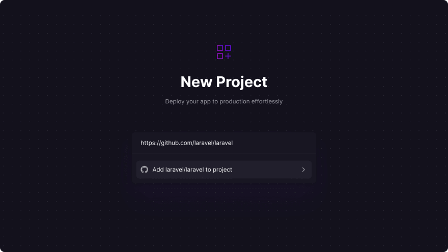

- If you gave Railway access to a GitHub repository, you automatically got push-to-deploy setup.

- Your project is now deploying, the build step should work fine, but you won't be able to visit your landing page because Laravel need a few environment variables to run.
   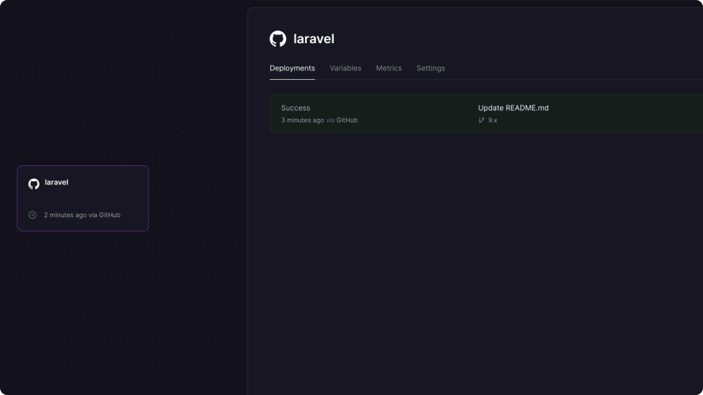

- You can paste the content of your `.env` file in the raw editor with the values you would like for production.

- We can also tell Nixpacks to add a few dependencies when building our project with the `NIXPACKS_PKGS` env variable, like PHP Redis to communicate with a Redis server, and PHP GD to work with images file.
   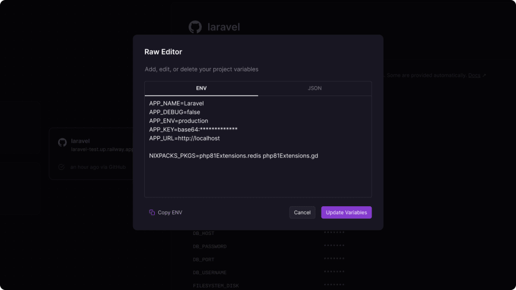

You can search for available packages here to make sure you get the syntax right.

- A new deployment will automatically start to rebuild your project with the provided environment variables.

- By default, your project will not be publicly accessible, you can head to the settings panel and generate a Railway subdomain with SSL, or follow instructions to use your own domain.

   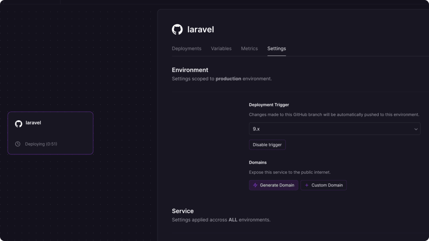

### Step2: Database creation:-

- Because the file system is reset on every deployment, using a local database like SQLite is not possible. Railway offers MySQL, PostgreSQL, MongoDB and Redis.

In your Railway project, click on the new button, and choose your favorite database management system.

   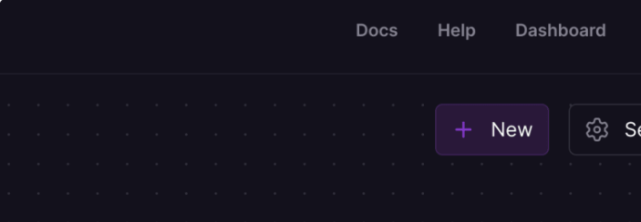

- Once created, you will be able to retrieve the credentials in the Variables panel.

   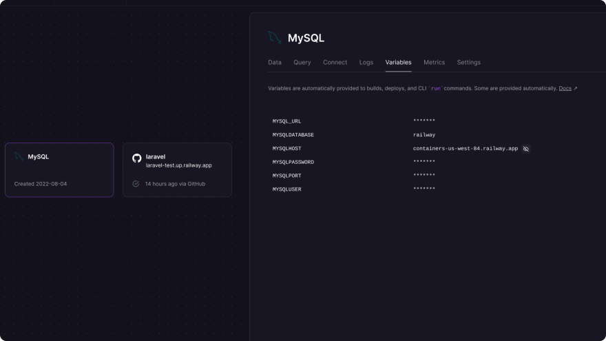

- You can copy these values in your Laravel project environment variable to give your code access to the database.

   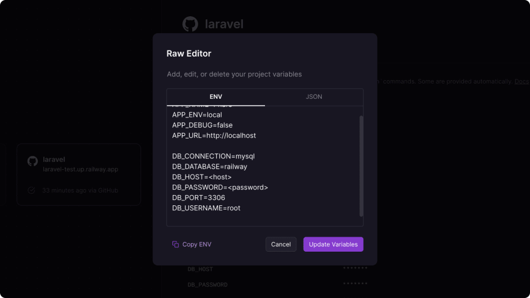

A new deployment will automatically rebuild your project with the provided environment variables and give your code access to the database. Keep in mind the database does not yet contain any table as we did not run Laravel's migration.

### Step3: Caching (Redis):-

- No persistent file system means that the default Laravel drivers for cache, queue, and session will not work properly, disconnecting our users at every deployment.

- To fix this we need Redis, it can be created the same way as our MySQL/PostgreSQL database.

   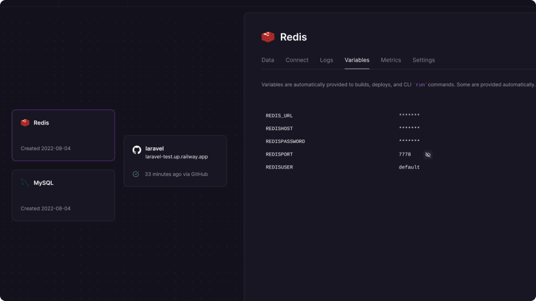

- Again, you will need to copy the credentials found in the Variables panel to your `.env` file, and configure Laravel session, cache, and queue to use the Redis driver.
   
   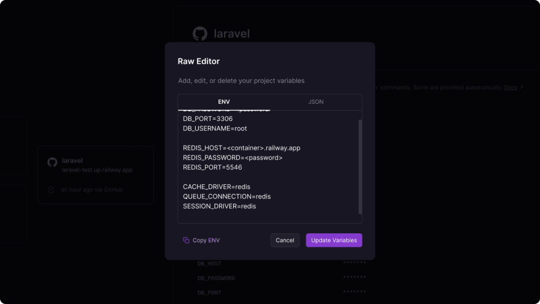

### Step4: Customizing the build step:-

- During deployment, Nixpack will install your project dependencies and run the build command of your `package.json` to build assets:

      - composer require
      - [yarn|npm|pnpm] install
      - [yarn|npm|pnpm] run build
  
  This is fine if you are serving a simple static site, but it is missing some Laravel specific steps.

- The best way to do this is to set the `NIXPACKS_BUILD_CMD` environment variable to run the following commands:

      - [yarn|npm|pnpm] run build
      - php artisan optimize
      - php artisan migrate --force

- we need to include the assets building step, as it will be otherwise replaced by our new commands.

    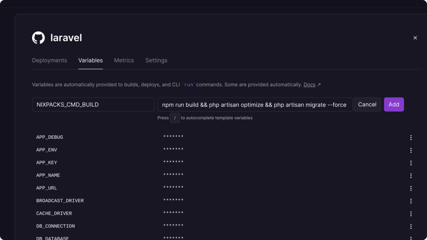

I illustrate a simple approach here by running each command in a chain with `&&`, but you could put all this in a composer script, a bash script or a Makefile.

### Step5: Creating a worker server:-

- Railway only allows a single process by server, you currently have a web process running nginx and serving your PHP code.What if you need another process to run a queue job in your app?

- Then we just create a new server to serve that exact purpose!

- In your Railway project, click on the new button, and choose your code repository again to create a second server.

- Copy all your environment variable to make sure both code instances run with the same configuration, and override the `NIXPACKS_START_CMD` variable to run Laravel queue worker instead of a web server.

   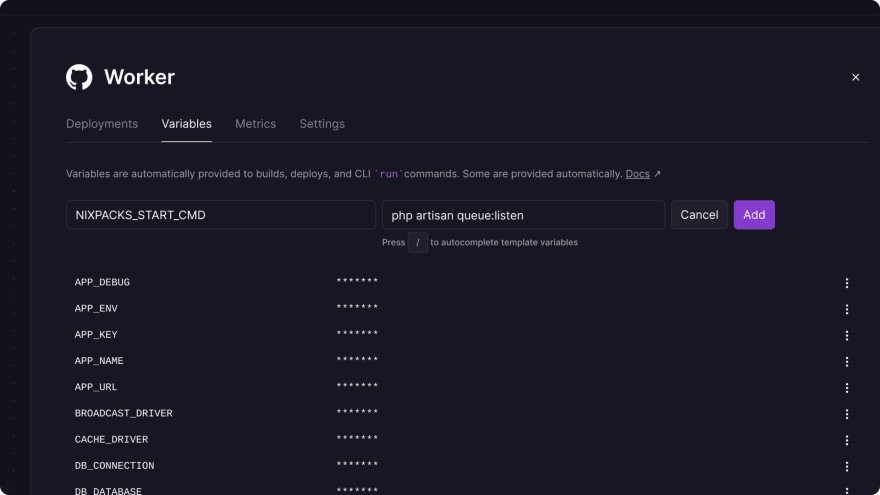

   Your worker should now process your queue jobs. You can create as many workers as you want with different configuration to suit your project's needs.

### Step6: Make signed route works:-

- You might already experience issues with signed routes if you worked with a load balancer before.When setting up a project, Railway will receive the request and proxy it to your server with the HTTP protocol.

      Request -https-> Railway -http-> Server

- When generating a signed route, Laravel with create a hash value of the full URL (which will be https), but when a user clicks the link, your code will verify the signature hash with a URL starting with `http` instead of `https`, making the signature invalid.

- There are two things you can add to your code to prevent this, first force all URLs to be generated with the `https` protocol. This can be done in your `AppServiceProvider` boot method:

```php
public function boot()
{
    if ($this->app->environment('production')) {
        URL::forceScheme('https');
    }
}
```

Then we need to trust Railway proxy to serve `https`, this can be configured in the `TrustProxies` middleware by setting the `proxies` property to a wildcard `*`:

```php

<?php

namespace App\Http\Middleware;

use Illuminate\Http\Middleware\TrustProxies as Middleware;
use Illuminate\Http\Request;

class TrustProxies extends Middleware
{
    protected $proxies = '*';

    ...
}

```

Using a wildcard might not be a best practice, but I could not find a list of Railway IPs, let me know if you find one!

### Step7: Blue green deployment

- Finally, we need to make deployment zero-downtime. For this, we need to make sure that when a new deployment is creating a new server, Railway can verify our code run properly before switching user traffic to the new server and shutting down the previous one.

- Railway offers health checks that do exactly this, you can choose the route that will be requested, and when it returns a success code (2xx), Railway will know that your server is ready to receive requests.

   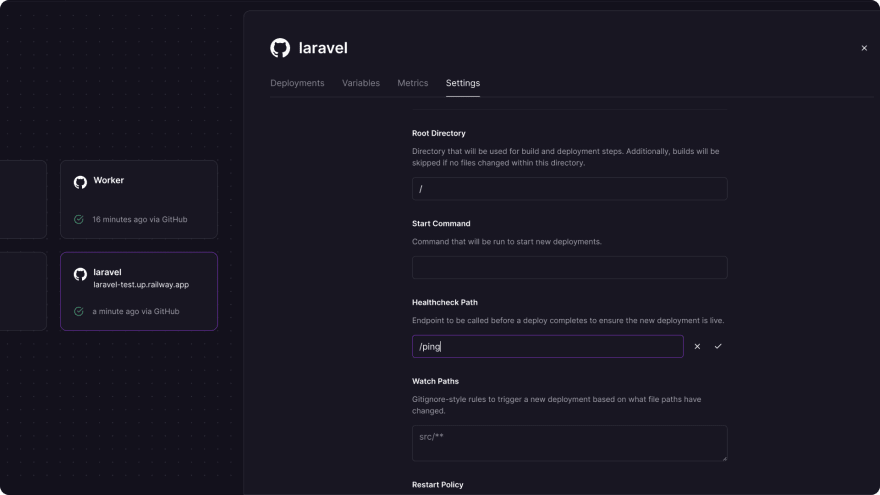